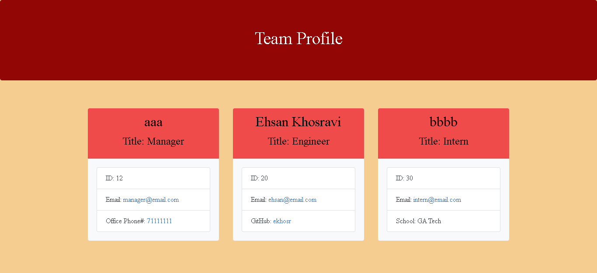

# Team-Profile-Generator

```md
With using this tool, users can generate profile for their team.
```

### Demo Video:

[Watch it Here](https://drive.google.com/file/d/1AaWLyg0kq-LTlWCFHcbt0sJurP-A2nfn/view?usp=sharing)

```sh
 https://drive.google.com/file/d/1AaWLyg0kq-LTlWCFHcbt0sJurP-A2nfn/view?usp=sharing
```

### A sample HTML:

[Jump to Sample HTML](https://github.com/ekhosr/Team-Profile-Generator/blob/main/dist/index.html)

```sh
 https://github.com/ekhosr/Team-Profile-Generator/blob/main/dist/index.html
```

## User Story

```md
AS A manager
I WANT to generate a webpage that displays my team's basic info
SO THAT I have quick access to their emails and GitHub profiles

```

## Application Step-by-Step:

```md
- By providing the following information, a profile will be generated for the team:

Manager's Card:
- Manager's Name
- Manager's ID
- Manager's Email Address
- Manager's Office Phone Number

Engineer's Card:
- Engineer's Name
- Engineer's ID
- Engineer's Email Address
- Engineer's GitHub Usernam

Intern's Card:
- Intern's Name
- Intern's ID
- Intern's Email Address
- Intern's School
```

## Generated Team Profile Sample:


